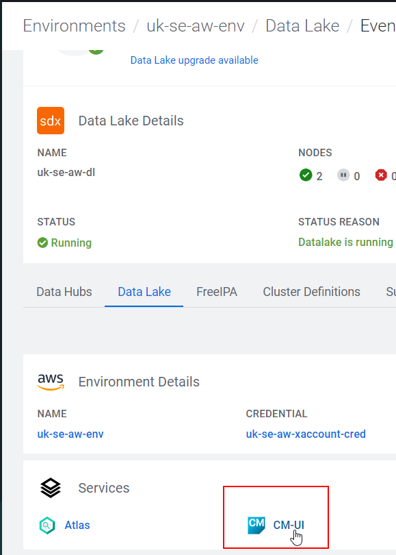
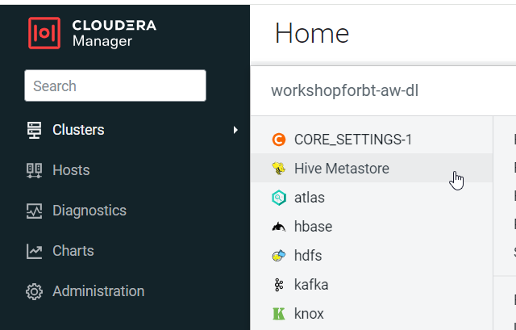

# Iceberg Lab

## Summary
This workshop will take you through the new capabilities that have been added to CDP Public Cloud Lakehouse and into the various features of the SqL stream builder.

In this workshop you will learn how to take advantage of Iceberg to support Data Lakehouse initiatives.

**Value Propositions**: Take advantage of Iceberg - CDP’s Open Data Lakehouse, to experience:  
- Better performance  
- Lower maintenance responsibilities  
- Multi-function analytics without having many copies of data  
- Greater control  

It will also 

*Note to admins: Refer to the Setup file containing the recommendations to setup the lab*


## TABLE OF CONTENT
[1. Introduction to the workshop](#1-introduction-to-the-workshop)  
[2. Table Maintenance in Iceberg](#2-table-maintenance-in-Iceberg)  
[3. Iceberg with NiFi and Sql Stream Builder](#3-introduction-to-iceberg-with-nifi)  
[4. Introduction to Iceberg with Sql Stream Builder](#4-introduction-to-iceberg-with-nifi)  


### 1. Introduction to the workshop  
**Goal of the section:   
Check the dataset made available in a database in a csv format and store it all as Iceberg.**  

#### 1. Data Set

Data set for this workshop is the publicly available Airlines data set, which consists of c.80million row of flight information across the United States.  
Schema for the data set is below:Entity-Relation Diagram of tables we use in todays workshop:

Fact table: flights (86mio rows)
Dimension tables: airlines (1.5k rows), airports (3.3k rows), planes (5k rows) and unique tickets (100k rows).

**Dataset airlines schema**  


**Raw format of the flight set**  

Here displayed in a file explorer:


#### 2. Access the data set in Cloudera Data Warehouse
In this section, we will check that the airlines data was ingested for you: you should be able to query the master database: `airlines_csv`. 
Each participant will then create their own Iceberg databases out of the shared master database.

Make a note of your username, in a CDP Public Cloud workshop, it should be a account from user01 to user50, 
assigned by your workshop presenter.  

Navigate to Data Warehouse service:
  


Then an **Impala** Virtual Warehouse and open the SQL Authoring tool HUE. There are two types of virtual warehouses you can create in CDW, 
here we'll be using the type that leverages **Impala** as an engine:  

  


Execute the following in HUE Impala Editor to test that data has loaded correctly and that you have the appropriate access.  
  


```SQL
SELECT COUNT(*) FROM airlines_csv.flights_csv;  
```

**Note: These queries use variables in Hue**

To set the variable value with your username, fill in the field as below:  
  


  

#### 3. Generating the Iceberg tables

In this section, we will generate the Iceberg database from the pre-ingested csv tables.   

To run several queries in a row in Hue, make sure you select all the queries:  

  


Run the below queries to create your own databases and ingest data from the master database.  
  

```SQL
-- CREATE DATABASES
-- EACH USER RUNS TO CREATE DATABASES
CREATE DATABASE ${user_id}_airlines;
CREATE DATABASE ${user_id}_airlines_maint;


-- CREATE HIVE TABLE FORMAT TO CONVERT TO ICEBERG LATER
drop table if exists ${user_id}_airlines.planes;

CREATE TABLE ${user_id}_airlines.planes (
  tailnum STRING, owner_type STRING, manufacturer STRING, issue_date STRING,
  model STRING, status STRING, aircraft_type STRING,  engine_type STRING, year INT 
) 
TBLPROPERTIES ( 'transactional'='false' )
;

INSERT INTO ${user_id}_airlines.planes
  SELECT * FROM airlines_csv.planes_csv;

-- HIVE TABLE FORMAT TO USE CTAS TO CONVERT TO ICEBERG
drop table if exists ${user_id}_airlines.airports_hive;

CREATE TABLE ${user_id}_airlines.airports_hive
   AS SELECT * FROM airlines_csv.airports_csv;

-- HIVE TABLE FORMAT
drop table if exists ${user_id}_airlines.unique_tickets;

CREATE TABLE ${user_id}_airlines.unique_tickets (
  ticketnumber BIGINT, leg1flightnum BIGINT, leg1uniquecarrier STRING,
  leg1origin STRING,   leg1dest STRING, leg1month BIGINT,
  leg1dayofmonth BIGINT, leg1dayofweek BIGINT, leg1deptime BIGINT,
  leg1arrtime BIGINT, leg2flightnum BIGINT, leg2uniquecarrier STRING,
  leg2origin STRING, leg2dest STRING, leg2month BIGINT, leg2dayofmonth BIGINT,
  leg2dayofweek BIGINT, leg2deptime BIGINT, leg2arrtime BIGINT 
);

INSERT INTO ${user_id}_airlines.unique_tickets
  SELECT * FROM airlines_csv.unique_tickets_csv;

-- CREATE ICEBERG TABLE FORMAT STORED AS PARQUET
drop table if exists ${user_id}_airlines.planes_iceberg;

CREATE TABLE ${user_id}_airlines.planes_iceberg
   STORED AS ICEBERG AS
   SELECT * FROM airlines_csv.planes_csv;

-- CREATE ICEBERG TABLE FORMAT STORED AS PARQUET
drop table if exists ${user_id}_airlines.flights_iceberg;

CREATE TABLE ${user_id}_airlines.flights_iceberg (
 month int, dayofmonth int, 
 dayofweek int, deptime int, crsdeptime int, arrtime int, 
 crsarrtime int, uniquecarrier string, flightnum int, tailnum string, 
 actualelapsedtime int, crselapsedtime int, airtime int, arrdelay int, 
 depdelay int, origin string, dest string, distance int, taxiin int, 
 taxiout int, cancelled int, cancellationcode string, diverted string, 
 carrierdelay int, weatherdelay int, nasdelay int, securitydelay int, 
 lateaircraftdelay int
) 
PARTITIONED BY (year int)
STORED AS ICEBERG 
;
```


### 2. Table Maintenance in Iceberg

Under the maintenance database, let's load the flight table partitioned by year.

```SQL

-- [TABLE MAINTENANCE] CREATE FLIGHTS TABLE IN ICEBERG TABLE FORMAT
drop table if exists ${user_id}_airlines_maint.flights;

CREATE TABLE ${user_id}_airlines_maint.flights (
 month int, dayofmonth int, 
 dayofweek int, deptime int, crsdeptime int, arrtime int, 
 crsarrtime int, uniquecarrier string, flightnum int, tailnum string, 
 actualelapsedtime int, crselapsedtime int, airtime int, arrdelay int, 
 depdelay int, origin string, dest string, distance int, taxiin int, 
 taxiout int, cancelled int, cancellationcode string, diverted string, 
 carrierdelay int, weatherdelay int, nasdelay int, securitydelay int, 
 lateaircraftdelay int
) 
PARTITIONED BY (year int)
STORED AS ICEBERG 
;


```

**Partition evolution**: the insert queries below are designed to demonstrate partition evolution
and snapshot feature for time travel 


```SQL
-- LOAD DATA TO SIMULATE SMALL FILES
INSERT INTO ${user_id}_airlines_maint.flights
 SELECT * FROM airlines_csv.flights_csv WHERE year = 1995 AND month = 1;
INSERT INTO ${user_id}_airlines_maint.flights
 SELECT * FROM airlines_csv.flights_csv WHERE year = 1995 AND month = 2;
INSERT INTO ${user_id}_airlines_maint.flights
 SELECT * FROM airlines_csv.flights_csv WHERE year = 1995 AND month = 3;
INSERT INTO ${user_id}_airlines_maint.flights
 SELECT * FROM airlines_csv.flights_csv WHERE year = 1995 AND month = 4;
INSERT INTO ${user_id}_airlines_maint.flights
 SELECT * FROM airlines_csv.flights_csv WHERE year = 1995 AND month = 5;
INSERT INTO ${user_id}_airlines_maint.flights
 SELECT * FROM airlines_csv.flights_csv WHERE year = 1995 AND month = 6;
INSERT INTO ${user_id}_airlines_maint.flights
 SELECT * FROM airlines_csv.flights_csv WHERE year = 1995 AND month = 7;
INSERT INTO ${user_id}_airlines_maint.flights
 SELECT * FROM airlines_csv.flights_csv WHERE year = 1995 AND month = 8;
INSERT INTO ${user_id}_airlines_maint.flights
 SELECT * FROM airlines_csv.flights_csv WHERE year = 1995 AND month = 9;
INSERT INTO ${user_id}_airlines_maint.flights
 SELECT * FROM airlines_csv.flights_csv WHERE year = 1995 AND month = 10;
INSERT INTO ${user_id}_airlines_maint.flights
 SELECT * FROM airlines_csv.flights_csv WHERE year = 1995 AND month = 11;
INSERT INTO ${user_id}_airlines_maint.flights
 SELECT * FROM airlines_csv.flights_csv WHERE year = 1995 AND month = 12;

INSERT INTO ${user_id}_airlines_maint.flights
 SELECT * FROM airlines_csv.flights_csv WHERE year = 1996 AND month = 1;
INSERT INTO ${user_id}_airlines_maint.flights
 SELECT * FROM airlines_csv.flights_csv WHERE year = 1996 AND month = 2;
INSERT INTO ${user_id}_airlines_maint.flights
 SELECT * FROM airlines_csv.flights_csv WHERE year = 1996 AND month = 3;
INSERT INTO ${user_id}_airlines_maint.flights
 SELECT * FROM airlines_csv.flights_csv WHERE year = 1996 AND month = 4;
INSERT INTO ${user_id}_airlines_maint.flights
 SELECT * FROM airlines_csv.flights_csv WHERE year = 1996 AND month = 5;
INSERT INTO ${user_id}_airlines_maint.flights
 SELECT * FROM airlines_csv.flights_csv WHERE year = 1996 AND month = 6;
INSERT INTO ${user_id}_airlines_maint.flights
 SELECT * FROM airlines_csv.flights_csv WHERE year = 1996 AND month = 7;
INSERT INTO ${user_id}_airlines_maint.flights
 SELECT * FROM airlines_csv.flights_csv WHERE year = 1996 AND month = 8;
INSERT INTO ${user_id}_airlines_maint.flights
 SELECT * FROM airlines_csv.flights_csv WHERE year = 1996 AND month = 9;
INSERT INTO ${user_id}_airlines_maint.flights
 SELECT * FROM airlines_csv.flights_csv WHERE year = 1996 AND month = 10;
INSERT INTO ${user_id}_airlines_maint.flights
 SELECT * FROM airlines_csv.flights_csv WHERE year = 1996 AND month = 11;
INSERT INTO ${user_id}_airlines_maint.flights
 SELECT * FROM airlines_csv.flights_csv WHERE year = 1996 AND month = 12;
```

#### 1. Partition evolution
Let's look at the file size. For reference only, and because Iceberg will integrate nicely with all the components of the Cloudera Data Platform 
and with different engines, the task can be performed in PySpark, looking like so:  

**In pyspark**  
  
```SQL
SELECT partition,file_path, file_size_in_bytes
FROM ${user_id}_airlines_maint.flights.files order by partition

```

Here we're sticking to the Cloudera Data Warehouse service for simplicity, so we'll perform the task using Impala.

**In Impala**  
  
```SQL
SHOW FILES in ${user_id}_airlines_maint.flights;
```

Make a note of the average file size which should be around 5MB.
Also note the path and folder structure: a folder is a partition, a file is an ingest as we performed them above.

Now, let's alter the table, adding a partition on the month on top of the year.  

```SQL
ALTER TABLE ${user_id}_airlines_maint.flights SET PARTITION SPEC (year, month);
```  
  
Check the partition fields in the table properties
```SQL

DESCRIBE EXTENDED  ${user_id}_airlines_maint.flights
```

  


Ingest a month worth of data.  
  
```SQL
INSERT INTO ${user_id}_airlines_maint.flights
 SELECT * FROM airlines_csv.flights_csv
 WHERE year <= 1996 AND month <= 1
```  

Let's have another look:   
  
```SQL
SHOW FILES in ${user_id}_airlines_maint.flights;
```  

Will show the newly ingested data, note the path, folder breakdown is different from before, with the additional partitioning over month taking place.


#### 2. Snapshots

From the INGEST queries earlier, snapshots was created and allow the time travel feature in Iceberg.

```SQL
DESCRIBE HISTORY ${user_id}_airlines_maint.flights;  
```  

Make a note of the timestamps for 2 different snapshots, as well as the snapshot id for one, you can then run:

```SQL
DESCRIBE HISTORY ${user_id}_airlines_maint.flights  BETWEEN '${Timestamp1}' AND '${Timestamp2}';
```
Timestamp format looks like this:  
`2024-04-11 09:48:07.654000000`  
  
  
```SQL

SELECT COUNT(*) FROM ${user_id}_airlines_maint.flights FOR SYSTEM_VERSION AS OF ${snapshotid}
SELECT * FROM ${user_id}_airlines_maint.flights FOR SYSTEM_VERSION AS OF ${snapshotid}

```
Snapshot id format looks like:
`3916175409400584430` **with no quotes**

#### 3. ACID V2

https://blog.min.io/iceberg-acid-transactions/
Let update a row.


```SQL
SELECT * FROM  ${user_id}_airlines_maint.flights LIMIT 1
```

Save the values for year, month, tailnum and deptime to be able to identify that row after update.
Example:  
```SQL

SELECT * FROM ${user_id}_airlines_maint.flights WHERE year = 1996 and MOnth = 2 and tailnum = 'N2ASAA'
and deptime = 730

----Now, Let's run an UPDATE Statement with will likely FAIL
UPDATE ${user_id}_airlines_maint.flights SET uniquecarrier = 'BB' 
WHERE year = 1996 and MOnth = 2 and tailnum = 'N2ASAA'
and deptime = 730
```

As Iceberg table are created as V1 by default, you might get an error message. You will be able to migrate the table from Iceberg V1 to V2 using the below query:
```SQL
ALTER TABLE ${user_id}_airlines_maint.flights SET TBLPROPERTIES('format-version'= '2')
---Reperform the UPDATE

UPDATE ${user_id}_airlines_maint.flights SET uniquecarrier = 'BB' 
WHERE year = 1996 and MOnth = 2 and tailnum = 'N2ASAA'
and deptime = 730

---Check that the update worked:
SELECT * FROM ${user_id}_airlines_maint.flights WHERE year = 1996 and MOnth = 2 and tailnum = 'N2ASAA'
and deptime = 730
```

Copy & paste the SQL below into HUE
```SQL
-- TEST PLANES PROPERTIES
DESCRIBE FORMATTED ${user_id}_airlines.planes;
```  

Pay attention to the following properties: 
- Table Type: `EXTERNAL`
- SerDe Library: `org.apache.hadoop.hive.ql.io.parquet.serde.ParquetHiveSerDe`
- Location: `warehouse/tablespace/external/hive/`

The following labs will take you through various CDP Public Cloud to enable you on what will be available to support Data Lakehouse use cases. 
CDP Public Cloud now includes support for Apache Iceberg in the following services: Impala, Flink, SSB, Spark 3, NiFi, and Replication (BDR). 
This makes Cloudera the only vendor to support Iceberg in a multi-hybrid cloud environment. 
Users can develop an Iceberg application once and deploy anywhere.  

**Handy Iceberg Links**  
[Apache Iceberg Documentation (be careful not everything may be supported yet in CDP)](https://iceberg.apache.org/docs/latest/)  
[Impala Iceberg Cheatsheet](https://docs.google.com/document/d/1cusHyLBA7hS5zLV0vVctymoEbUviJi4aT8SfKyIe_Ao/edit?usp=drive_link)  

### 2. Introduction to Iceberg with NiFi  

In this very short lab we are going to use Nifi to load data into Kafka and Iceberg:  
- First, we will use NiFi to ingest an airport route data set (JSON) and send that data to Kafka and Iceberg.  
- Next we will use NiFi to ingest a countries data set (JSON) and send to Kafka and Iceberg.   
- Finally we will use NiFi to ingest an airports data set (JSON) and send to Kafka and Iceberg.   
  
#### 1. Setup 1 - Create the table in Hue
While still in Hue, please run the below to create Iceberg tables as destination for the Nifi flow will deploy just after:

```SQL
-- TABLES NEEDED FOR THE NIFI LAB
DROP TABLE IF EXISTS ${user_id}_airlines.`routes_nifi_iceberg`;
CREATE TABLE ${user_id}_airlines.`routes_nifi_iceberg` (
  `airline_iata` VARCHAR,
  `airline_icao` VARCHAR,
  `departure_airport_iata` VARCHAR,
  `departure_airport_icao` VARCHAR,
  `arrival_airport_iata` VARCHAR,
  `arrival_airport_icao` VARCHAR,
  `codeshare` BOOLEAN,
  `transfers` BIGINT,
  `planes` ARRAY<VARCHAR>
) STORED AS ICEBERG;

DROP TABLE IF EXISTS ${user_id}_airlines.`airports_nifi_iceberg`;
CREATE TABLE ${user_id}_airlines.`airports_nifi_iceberg` (
  `city_code` VARCHAR,
  `country_code` VARCHAR,
  `name_translations` STRUCT<`en`:string>,
  `time_zone` VARCHAR,
  `flightable` BOOLEAN,
  `coordinates` struct<`lat`:DOUBLE, `lon`:DOUBLE>,
  `name` VARCHAR,
  `code` VARCHAR,
  `iata_type` VARCHAR
) STORED AS ICEBERG;

DROP TABLE IF EXISTS ${user_id}_airlines.`countries_nifi_iceberg`;
CREATE TABLE ${user_id}_airlines.`countries_nifi_iceberg` (
  `name_translations` STRUCT<`en`:VARCHAR>,
  `cases` STRUCT<`su`:VARCHAR>,
  `code` VARCHAR,
  `name` VARCHAR,
  `currency` VARCHAR
) STORED AS ICEBERG;
```


#### 2. Setup 2 - Collect all the configuration details for the flow

You'll need a few information from the workspace to configure the pre-designed flow:
- Your keytab
- Kafka Endpoints
- Hive Metastore URI


**Download you Kerberos Keytab**  
On the left hand menu, click on your username and access the Profile menu. On the right, under Actions, click Get keytab. 
Access your user profile
  

Download the keytab file
  


**Collect the Kafka Broker endpoints**
In CDP Public Cloud, Kafka is deployed in a Datahub, which is a step previously setup by the lab admin.
  
The Endpoints are available on the overview page of the Datahub indicated by the admin, on the bottom menu,
under "endpoints".  

Kafka Endpoints in Datahub overview


**Grab the Hive Metastore URI**
The hive metastore for the datalake is indicated in the configuration file:  
  
Access the Management Console:  

  


Select the Datalake:  

  


Access the url for the Cloudera Manager of the environment:  

  


Access the Hive metastore service in Cloudera Manager: 

  

Download the Configuration files in a zip:  


In the hive-conf.xml file, grab the value for the hive.metastore.uris
  

Hive Metastore URI example:

`thrift://workshopforbt-aw-dl-master0.workshop.vayb-xokg.cloudera.site:9083`


#### 3. Deploy the Nifi Flow

Access the Cloudera Data Flow Service:  
  
Let's deploy our NiFi flows. Access the data catalog and identify the `SSB Demo - Iceberg` Flow and deploy it:  

  


In the Flow deployment wizard, pick a name for your flow (indicate your usename to avoid confusion with other participant's flow).
In the parameter's page, fill in the fields with the value for the parameters necessary to configure the flow.

|Parameter|Value|
|----------|----------|
|CDP Workload User|<enter your user id>|
|CDP Workload User Password|<enter your login password> and set sensitive to ‘Yes’|
|Hadoop Configuration Resources|/etc/hive/conf/hive-site.xml,/etc/hadoop/conf/core-site.xml,/etc/hive/conf/hdfs-site.xml|
|Kerberos Keytab|/tmp/<user-id>_nifi.keytab|
|Hive Metastore URI|thrift://base1-01.lab##.pvc-ds-bc.athens.cloudera.com:9083,thrift://base2-01.lab##.pvc-ds-bc.athens.cloudera.com:9083|
|Kafka Broker Endpoint|`Kafka Endpoints`|  
  

### 3. Introduction to Iceberg with Sql Stream Builder  
Once we are complete with NiFi, we will shift into Sql Streams Builder to show its capability to query Kafka with SQL,
Infer Schema, Create Iceberg Connectors,  and use SQL to INSERT INTO an Iceberg Table.  
Finally we will wrap up by jumping back into Hue and taking a look at the tables we created.


#### 1.Configuration details for SSB

You'll need:
- The Kafka endpoints you'll be querying
- The thrift Hive URI

**Copy/paste the thrift Hive URI**   
In the Cloudera Data Warehousing service, identify the Hive Virtual Warehouse and copy the JDBC url and keep only the node name in the string:  
`hs2-asdf.dw-go01-demo-aws.ylcu-atmi.cloudera.site`


Access the SSB datahub indicated by the workshop presenter and perform the below steps:

1. Import this repo as a project in Sql Stream Builder
2. Open your Project and have a look around at the left menu. Notice all hover tags. Explore the vast detail in Explorer menus.
3. Import Your Keytab
4. Check out Source Control. If you created vs import on first screen you may have to press import here still. You can setup Authentication here.
5. Create and activate an Environment with a key value pair for your userid -> username
6. Inspect/Add Data Sources. You may need to re-add Kafka. The Hive data source should work out of the box.
7. Inspect/Add Virtual Kafka Tables. You can edit the existing tables against your kafka data source and correct topics. Just be sure to choose right topics and detect schema before save.

  
  
  
Open the SSB UI by clicking on Streaming SQL Console.

  
 
Create Kafka Data Store: Create Kafka Data Store by selecting Data Sources in the left pane,
clicking on the three-dotted icon next to Kafka, then selecting New Kafka Data Source.
  
  
**Name**: {user-id}_cdp_kafka. 
**Brokers**: (Comma-separated List as shown below)
  
Example: `bt-kafka-corebroker2.workshop.vayb-xokg.cloudera.site:9093, 
  bt-kafka-corebroker1.workshop.vayb-xokg.cloudera.site:9093,
  bt-kafka-corebroker0.workshop.vayb-xokg.cloudera.site:9093`
**Protocol**: SASL/SSL
**SASL Mechanism**: PLAIN.
**SASL Username**: <CDP Username>. 
**SASL Password**: Workload User password set by your admin as defined earlier/

## Modifications to Jobs
Note: current repo should not require any job modifications.

**CSA_1_11_Iceberg_Sample** - Example in CSA 1.11 docs  
No modifications should be required to this job  
**Countries_Kafka** - Select from Kafka Countries, Create IceBerg Table, Insert Results  
Confirm Kafka topic  
**Routes_Kafka** - Select from Kafka Routes, Create IceBerg Table, Insert Results  
Confirm Kafka topic  
**Test_Hue_Tables**  
Confirm source iceberg table exists, check table names, and namespaces.  
**Time_Travel**  
Execute required DESCRIBE in Hue, use SnapShot Ids  


### Top Tips
If you are using different topics w/ different schema, use SSB to get the DDL for topic. Copy paste into the ssb job's create statement and begin modifying to acceptance. Just be careful with complicated schema such as array, struct, etc.
If you are testing CREATE and INSERT in iterations, you should increment all table names per test iteration. Your previous interations will effect next iterations so stay in unique table names.
Use DROP statement with care. It will DROP your Virtual Table, but not necessarily the impala/hive table. DROP those in HUE if needed.
Execution of Jobs:
Warning: These are not full ssb jobs. In these are samples you execute each statements one at a time.

```
Execute the SELECT * FROM kafka_topic. This will confirm that you have results in your kafka topic. Be patient, if this is your first job may take some time (1-2 minutes) to report results.
Execute the CREATE TABLE Statement. This will create the virtual table in ssb_default name space. It will not create the table in IMPALA.
Execute the INSERT INTO SELECT. Be Patient. This will create the impala table and begin reporting results from the kafka topic shortly.
Lastly, execute the final select. These results are from IMPALA.
```

