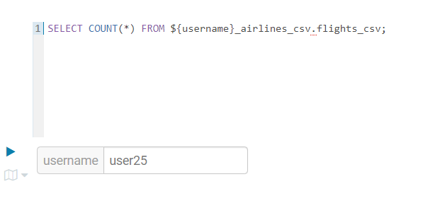

# Iceberg and SQL Stream Builder Lab

## Summary
This workshop will take you through the new capabilities that have been added to CDP Public Cloud Lakehouse and into the various features of the Sql stream builder.

In this workshop you will learn how to take advantage of Iceberg to support Data Lakehouse initiatives.

**Value Propositions**:  

Take advantage of Iceberg - **CDP Open Data Lakehouse**, to experience:  
- Better performance  
- Lower maintenance responsibilities  
- Multi-function analytics without having many copies of data  
- Greater control  

It will also give on overview of **Cloudera Data Flow** to give hands on experience of:  
- Real-time data streaming  
- Out of the box connection to various data sources and integration with Iceberg  
- Easy deployment of data pipelines using no code and accelerators  

And finally an overview of the SQL Stream Builder powered by Flink including:  
- Make streaming processing accessible with simply SQL  
- Easy integration with Iceberg  


*Note to admins: Refer to the Setup file containing the recommendations to setup the lab*


## TABLE OF CONTENT
  * [1. Introduction to the workshop](#1-introduction-to-the-workshop)  
    * [1.1. Logging in](##11-logging-in)  
    * [1.2. Data Set](##11-data-set)   
    * [1.3. Access the data set in Cloudera Data Warehouse](##13-access-the-data-set-in-cloudera-data-warehouse)  
    * [1.4. Generating the Iceberg tables](##14-generating-the-iceberg-tables)   
  * [2. Table Maintenance in Iceberg](#2-table-maintenance-in-Iceberg)  
    * [2.1. Loading data](##21-loading-data)  
    * [2.2. Partition evolution](22-partition-evolution)  
    * [2.3. Snapshots](##23-snapshots)  
  * [3. Introduction to Iceberg with NiFi ](#3-introduction-to-iceberg-with-nifi)   
    * [3.1. Setup 1 - Create the table in Hue](##31-setup-1-create-the-table-in-hue)  
    * [3.2. Setup 2 - Collect all the configuration details](##32-setup-2-collect-all-the-configuration-details)  
    * [3.3. Deploy the Nifi Flow](##33-deploy-the-nifi-flow)  
  * [4. Introduction to Iceberg with Sql Stream Builder ](#4-introduction-to-iceberg-with-sql-stream-builder) 
    * [4.1. Setup SSB: Project creation](##41-setup-ssb-project-creation)


### 1. Introduction to the workshop  
**Goal of the section:   
Check the dataset made available in a database in a csv format and store it all as Iceberg.** 

#### 1.1. Logging in

Access the url indicated by the presenter and indicate your credentials.

_Make a note of your username, in a CDP Public Cloud workshop, it should be a account from user01 to user50, assigned by your workshop presenter. It will be useful during the lab._

#### 1.2. Data Set description

Data set for this workshop is the publicly available Airlines data set, which consists of c.80million row of flight information across the United States.  
For additional information : [Data Set Description](./documentation/IcebergLab-Documentation.md#data-set)

#### 1.3. Access the data set in Cloudera Data Warehouse
In this section, we will check that the airlines data was ingested for you: you should be able to query the master database: `airlines_csv`.   

Each participant will then create their own Iceberg databases out of the shared master database.


Navigate to Data Warehouse service:
  


Then choose an **Impala** Virtual Warehouse and open the SQL Authoring tool HUE. There are two types of virtual warehouses you can create in CDW, here we'll be using the type that leverages **Impala** as an engine:  

  


Execute the following in **HUE** Impala Editor to test that data has loaded correctly and that you have the appropriate access.   
  
```SQL
SELECT COUNT(*) FROM airlines_csv.flights_csv; 
```

**Expected output**  


  
#### 1.4. Generating the Iceberg tables

In this section, we will generate the Iceberg database from the pre-ingested csv tables.   

**Run the below queries to create your own databases and ingest data from the master database**  
  

```SQL
-- CREATE DATABASES
-- EACH USER RUNS TO CREATE DATABASES
CREATE DATABASE ${user_id}_airlines;
CREATE DATABASE ${user_id}_airlines_maint;
```

*Note: These queries use variables in Hue

To set the variable value with your username, fill in the field as below:  

  


To run several queries in a row in Hue, make sure you select all the queries:*  

  


  
**Once the database is created, create the Hive tables first**  


```SQL
-- CREATE HIVE TABLE FORMAT TO CONVERT TO ICEBERG LATER
drop table if exists ${user_id}_airlines.planes;

CREATE TABLE ${user_id}_airlines.planes (
  tailnum STRING, owner_type STRING, manufacturer STRING, issue_date STRING,
  model STRING, status STRING, aircraft_type STRING,  engine_type STRING, year INT 
) 
TBLPROPERTIES ( 'transactional'='false' )
;

INSERT INTO ${user_id}_airlines.planes
  SELECT * FROM airlines_csv.planes_csv;

-- HIVE TABLE FORMAT TO USE CTAS TO CONVERT TO ICEBERG
drop table if exists ${user_id}_airlines.airports_hive;

CREATE TABLE ${user_id}_airlines.airports_hive
   AS SELECT * FROM airlines_csv.airports_csv;

-- HIVE TABLE FORMAT
drop table if exists ${user_id}_airlines.unique_tickets;

CREATE TABLE ${user_id}_airlines.unique_tickets (
  ticketnumber BIGINT, leg1flightnum BIGINT, leg1uniquecarrier STRING,
  leg1origin STRING,   leg1dest STRING, leg1month BIGINT,
  leg1dayofmonth BIGINT, leg1dayofweek BIGINT, leg1deptime BIGINT,
  leg1arrtime BIGINT, leg2flightnum BIGINT, leg2uniquecarrier STRING,
  leg2origin STRING, leg2dest STRING, leg2month BIGINT, leg2dayofmonth BIGINT,
  leg2dayofweek BIGINT, leg2deptime BIGINT, leg2arrtime BIGINT 
);

INSERT INTO ${user_id}_airlines.unique_tickets
  SELECT * FROM airlines_csv.unique_tickets_csv;
  
```
Copy & paste the SQL below into HUE

```SQL
-- TEST PLANES PROPERTIES
DESCRIBE FORMATTED ${user_id}_airlines.planes;
```  

Pay attention to the following properties: 
- Table Type: `EXTERNAL`
- SerDe Library: `org.apache.hadoop.hive.ql.io.parquet.serde.ParquetHiveSerDe`
- Location: `warehouse/tablespace/external/hive/`

```SQL
-- CREATE ICEBERG TABLE FORMAT STORED AS PARQUET
drop table if exists ${user_id}_airlines.planes_iceberg;

CREATE TABLE ${user_id}_airlines.planes_iceberg
   STORED AS ICEBERG AS
   SELECT * FROM airlines_csv.planes_csv;

-- CREATE ICEBERG TABLE FORMAT STORED AS PARQUET
drop table if exists ${user_id}_airlines.flights_iceberg;

CREATE TABLE ${user_id}_airlines.flights_iceberg (
 month int, dayofmonth int, 
 dayofweek int, deptime int, crsdeptime int, arrtime int, 
 crsarrtime int, uniquecarrier string, flightnum int, tailnum string, 
 actualelapsedtime int, crselapsedtime int, airtime int, arrdelay int, 
 depdelay int, origin string, dest string, distance int, taxiin int, 
 taxiout int, cancelled int, cancellationcode string, diverted string, 
 carrierdelay int, weatherdelay int, nasdelay int, securitydelay int, 
 lateaircraftdelay int
) 
PARTITIONED BY (year int)
STORED AS ICEBERG 
;
```


Copy & paste the SQL below into HUE

```SQL
-- TEST PLANES PROPERTIES
DESCRIBE FORMATTED ${user_id}_airlines.planes_iceberg;
```

Pay attention to the following properties for this Iceberg table, compared to the same table in Hive format:
- Table Type: `	EXTERNAL_TABLE`
- SerDe Library: `org.apache.iceberg.mr.hive.HiveIcebergSerDe`
- Location: `/warehouse/tablespace/external/hive/user020_airlines.db/planes_iceberg	`


You now have your own database you can run the below queries over:  


### 2. Table Maintenance in Iceberg

In this section, we will load data in Iceberg format and demonstrate a few key maintenance features of Iceberg.

#### 2.1. Loading data

Under the 'maintenance' database, let's load the flight table partitioned by year.  


```SQL
-- [TABLE MAINTENANCE] CREATE FLIGHTS TABLE IN ICEBERG TABLE FORMAT
drop table if exists ${user_id}_airlines_maint.flights;

CREATE TABLE ${user_id}_airlines_maint.flights (
 month int, dayofmonth int, 
 dayofweek int, deptime int, crsdeptime int, arrtime int, 
 crsarrtime int, uniquecarrier string, flightnum int, tailnum string, 
 actualelapsedtime int, crselapsedtime int, airtime int, arrdelay int, 
 depdelay int, origin string, dest string, distance int, taxiin int, 
 taxiout int, cancelled int, cancellationcode string, diverted string, 
 carrierdelay int, weatherdelay int, nasdelay int, securitydelay int, 
 lateaircraftdelay int
) 
PARTITIONED BY (year int)
STORED AS ICEBERG 
;
```

**Partition evolution**: the insert queries below are designed to demonstrate partition evolution
and snapshot feature for time travel 


```SQL
-- LOAD DATA TO SIMULATE SMALL FILES
INSERT INTO ${user_id}_airlines_maint.flights
 SELECT * FROM airlines_csv.flights_csv WHERE year = 1995 AND month = 1;
INSERT INTO ${user_id}_airlines_maint.flights
 SELECT * FROM airlines_csv.flights_csv WHERE year = 1995 AND month = 2;
INSERT INTO ${user_id}_airlines_maint.flights
 SELECT * FROM airlines_csv.flights_csv WHERE year = 1995 AND month = 3;
INSERT INTO ${user_id}_airlines_maint.flights
 SELECT * FROM airlines_csv.flights_csv WHERE year = 1995 AND month = 4;
INSERT INTO ${user_id}_airlines_maint.flights
 SELECT * FROM airlines_csv.flights_csv WHERE year = 1995 AND month = 5;
INSERT INTO ${user_id}_airlines_maint.flights
 SELECT * FROM airlines_csv.flights_csv WHERE year = 1995 AND month = 6;
INSERT INTO ${user_id}_airlines_maint.flights
 SELECT * FROM airlines_csv.flights_csv WHERE year = 1995 AND month = 7;
INSERT INTO ${user_id}_airlines_maint.flights
 SELECT * FROM airlines_csv.flights_csv WHERE year = 1995 AND month = 8;
INSERT INTO ${user_id}_airlines_maint.flights
 SELECT * FROM airlines_csv.flights_csv WHERE year = 1995 AND month = 9;
INSERT INTO ${user_id}_airlines_maint.flights
 SELECT * FROM airlines_csv.flights_csv WHERE year = 1995 AND month = 10;
INSERT INTO ${user_id}_airlines_maint.flights
 SELECT * FROM airlines_csv.flights_csv WHERE year = 1995 AND month = 11;
INSERT INTO ${user_id}_airlines_maint.flights
 SELECT * FROM airlines_csv.flights_csv WHERE year = 1995 AND month = 12;

INSERT INTO ${user_id}_airlines_maint.flights
 SELECT * FROM airlines_csv.flights_csv WHERE year = 1996 AND month = 1;
INSERT INTO ${user_id}_airlines_maint.flights
 SELECT * FROM airlines_csv.flights_csv WHERE year = 1996 AND month = 2;
INSERT INTO ${user_id}_airlines_maint.flights
 SELECT * FROM airlines_csv.flights_csv WHERE year = 1996 AND month = 3;
INSERT INTO ${user_id}_airlines_maint.flights
 SELECT * FROM airlines_csv.flights_csv WHERE year = 1996 AND month = 4;
INSERT INTO ${user_id}_airlines_maint.flights
 SELECT * FROM airlines_csv.flights_csv WHERE year = 1996 AND month = 5;
INSERT INTO ${user_id}_airlines_maint.flights
 SELECT * FROM airlines_csv.flights_csv WHERE year = 1996 AND month = 6;
INSERT INTO ${user_id}_airlines_maint.flights
 SELECT * FROM airlines_csv.flights_csv WHERE year = 1996 AND month = 7;
INSERT INTO ${user_id}_airlines_maint.flights
 SELECT * FROM airlines_csv.flights_csv WHERE year = 1996 AND month = 8;
INSERT INTO ${user_id}_airlines_maint.flights
 SELECT * FROM airlines_csv.flights_csv WHERE year = 1996 AND month = 9;
INSERT INTO ${user_id}_airlines_maint.flights
 SELECT * FROM airlines_csv.flights_csv WHERE year = 1996 AND month = 10;
INSERT INTO ${user_id}_airlines_maint.flights
 SELECT * FROM airlines_csv.flights_csv WHERE year = 1996 AND month = 11;
INSERT INTO ${user_id}_airlines_maint.flights
 SELECT * FROM airlines_csv.flights_csv WHERE year = 1996 AND month = 12;
```

#### 2.2. Partition evolution  
  
  
Let's look at the file size. 

**In Impala**  
  
```SQL
SHOW FILES in ${user_id}_airlines_maint.flights;
```  

**For reference only**, you can check out other ways to run that command: [pyspark](documentation/IcebergLab-Documentation.md#pyspark)

Make a note of the average file size which should be around 5MB.
Also note the path and folder structure: a folder is a partition, a file is an ingest as we performed them above.

Now, let's alter the table, adding a partition on the month on top of the year.  

```SQL
ALTER TABLE ${user_id}_airlines_maint.flights SET PARTITION SPEC (year, month);
```  
  
Check the partition fields in the table properties
```SQL
DESCRIBE EXTENDED  ${user_id}_airlines_maint.flights
```

  


Ingest a month worth of data.  
  
```SQL
INSERT INTO ${user_id}_airlines_maint.flights
 SELECT * FROM airlines_csv.flights_csv
 WHERE year <= 1996 AND month <= 1
```  

Let's have another look:   
  
```SQL
SHOW FILES in ${user_id}_airlines_maint.flights;
```  

Will show the newly ingested data, note the path, folder breakdown is different from before, with the additional partitioning over month taking place.


#### 2.3. Snapshots

From the INGEST queries earlier, snapshots was created and allow the time travel feature in Iceberg 
and this section will demonstrate the kind of operation you can run using that feature.

```SQL
DESCRIBE HISTORY ${user_id}_airlines_maint.flights;  
```  

Make a note of the timestamps for 2 different snapshots, as well as the snapshot id for one, you can then run:

```SQL
DESCRIBE HISTORY ${user_id}_airlines_maint.flights  BETWEEN '${Timestamp1}' AND '${Timestamp2}';
```
Timestamp format looks like this:  
`2024-04-11 09:48:07.654000000`  

You can run queries on the content of a snapshot refering its SnapshotID or timestamp:    
  
```SQL
SELECT COUNT(*) FROM ${user_id}_airlines_maint.flights FOR SYSTEM_VERSION AS OF ${snapshotid}
```
 or for example:  
 
```SQL
SELECT * FROM ${user_id}_airlines_maint.flights FOR SYSTEM_VERSION AS OF ${snapshotid}

```
Snapshot id format looks like:
`3916175409400584430` **with no quotes**

#### 3. ACID V2

Here we'll show the commands that could be run concomitantly thanks to [ACID](./documentation/IcebergLab-Documentation.md#acid) in Iceberg
Let's update a row.  


First, let's find a row:  

```SQL
SELECT year, month, tailnum, deptime, uniquecarrier  FROM  ${user_id}_airlines_maint.flights LIMIT 1
```
Save the values for year, month, tailnum and deptime to be able to identify that row after update.
Example:

  

You can bring back that row with a SELECT on a few unique characteristics and we'll update the uniquecarrier value to something else.

```SQL
SELECT * FROM ${user_id}_airlines_maint.flights
WHERE year = ${year}
  AND month = ${month}
  AND tailnum = '${tailnum}'
  AND deptime = ${deptime};
```


As Iceberg table are created as V1 by default, 
you will be able to migrate the table from Iceberg V1 to V2 using the below query:
```SQL
ALTER TABLE ${user_id}_airlines_maint.flights
SET TBLPROPERTIES('format-version'= '2')
```
Then try the UPDATE:

```SQL

UPDATE ${user_id}_airlines_maint.flights
SET uniquecarrier = 'BB' 
WHERE year = ${year}
  AND month = ${month}
  AND tailnum = '${tailnum}'
  AND deptime = ${deptime};

--- Check that the update worked:
SELECT * FROM ${user_id}_airlines_maint.flights
WHERE year = ${year}
  AND month = ${month}
  AND tailnum = '${tailnum}'
  AND deptime = ${deptime};
```

The following labs will take you through various aspects of CDP Public Cloud to enable you on what will be available to support Data Lakehouse use cases. 
CDP Public Cloud now includes support for Apache Iceberg in the following services: Impala, Hive, Flink, Sql Stream Builder (SSB), Spark 3, NiFi, and Replication Manager (BDR).
  
This makes Cloudera the only vendor to support Iceberg in a multi-hybrid cloud environment. 
Users can develop an Iceberg application once and deploy anywhere.  


### 3. Introduction to Iceberg with NiFi  

In this very short lab we are going to use Nifi to load data into Kafka and Iceberg:  
- First, we will use NiFi to ingest an airport route data set (JSON) and send that data to Kafka and Iceberg.  
- Next we will use NiFi to ingest a countries data set (JSON) and send to Kafka and Iceberg.   
- Finally we will use NiFi to ingest an airports data set (JSON) and send to Kafka and Iceberg.   
  
#### 3.1. Setup 1 - Create the table in Hue
While still in Hue, please run the below to create Iceberg tables as destination for the Nifi flow we will deploy just after:

```SQL
-- TABLES NEEDED FOR THE NIFI LAB
DROP TABLE IF EXISTS ${user_id}_airlines.`routes_nifi_iceberg`;
CREATE TABLE ${user_id}_airlines.`routes_nifi_iceberg` (
  `airline_iata` VARCHAR,
  `airline_icao` VARCHAR,
  `departure_airport_iata` VARCHAR,
  `departure_airport_icao` VARCHAR,
  `arrival_airport_iata` VARCHAR,
  `arrival_airport_icao` VARCHAR,
  `codeshare` BOOLEAN,
  `transfers` BIGINT,
  `planes` ARRAY<VARCHAR>
) STORED AS ICEBERG;

DROP TABLE IF EXISTS ${user_id}_airlines.`airports_nifi_iceberg`;
CREATE TABLE ${user_id}_airlines.`airports_nifi_iceberg` (
  `city_code` VARCHAR,
  `country_code` VARCHAR,
  `name_translations` STRUCT<`en`:string>,
  `time_zone` VARCHAR,
  `flightable` BOOLEAN,
  `coordinates` struct<`lat`:DOUBLE, `lon`:DOUBLE>,
  `name` VARCHAR,
  `code` VARCHAR,
  `iata_type` VARCHAR
) STORED AS ICEBERG;

DROP TABLE IF EXISTS ${user_id}_airlines.`countries_nifi_iceberg`;
CREATE TABLE ${user_id}_airlines.`countries_nifi_iceberg` (
  `name_translations` STRUCT<`en`:VARCHAR>,
  `cases` STRUCT<`su`:VARCHAR>,
  `code` VARCHAR,
  `name` VARCHAR,
  `currency` VARCHAR
) STORED AS ICEBERG;
```


#### 3.2. Setup 2 - Collect all the configuration details

You'll need a few information from the workspace to configure the pre-designed flow:
- Your keytab
- Kafka Endpoints
- Hive Metastore URI


##### Download your Kerberos Keytab

Change from your HUE tab back to the tab with the CDW UI. On the left hand menu,
click on your username and access the Profile page. On the right, under Actions, click Get keytab.

  

Download the keytab file  
  
  

Select the correct [CDP environment](./documentation/IcebergLab-Documentation.md#cdp-environments), you can ask the presenter for it:  


  


##### Set your Workload password

In your profile, set your [workload password](./documentation/IcebergLab-Documentation.md#workload-password), for the purpose of this lab, 
just pick the same password as your login credentials but in a production environment, that is of course not best practice.  


**Get your [Kafka Endpoints](./documentation/IcebergLab-Documentation.md#kafka-broker-endpoints) from your presenter**


**Get the [Hive Metastore URI](./documentation/IcebergLab-Documentation.md#hive-metastore-uri) from your presenter**

#### 3.3. Deploy the Nifi Flow

Access the Cloudera Data Flow Service:   
  
  
  
Let's deploy our NiFi flows. Access the Flow Catalog and identify the `SSB Demo - Iceberg` Flow

  

and deploy it:  


The **Target Workspace** selector is used to choose in which of the available CDP
Environments to create the new flow Deployment. For this lab, we only have one,
but a typical pattern would be to have separate Environments for development,
testing and production deployments.

In the Flow deployment wizard, pick a name for your flow (include your usename
to avoid confusion with other participants' flows).

You can pick a project at this stage or leave it "Unassigned". Projects are used to limit the visibility of drafts, deployments, Inbound Connections, and custom NAR Configurations within an Environment.

On the next page, "NiFi Configuration", keep all the default options, including
the NiFi version.
  
On the next page, "Parameters", fill in the fields with the value for the parameters necessary to configure the flow.

|Parameter|Value|Image|
|----------|----------|----------|
|CDP Workload User|Enter your user id(ex: `user001`)||
|CDP Workload User Password|Enter your workload password (which is the same as your login password and that you can set under your profile and set sensitive to ‘Yes’||
|Hadoop Configuration Resources|Collected earlier in the hive-clientconfig zip file downloaded from the datalake's Cloudera Manager `hive-site.xml`,`core-site.xml`,`hdfs-site.xml`||
|Hive Metastore URI|Collected earlier. Ex:`thrift://workshop-aw-dl-master0.workshop.vayb-xokg.cloudera.site:9083`||
|Kafka Broker Endpoint|Collected earlier. Ex `kafka-corebroker2.workshop.vayb-xokg.cloudera.site:9093, kafka-corebroker1.workshop.vayb-xokg.cloudera.site:9093, kafka-corebroker0.workshop.vayb-xokg.cloudera.site:9093`||  
|Kerberos Keytab|Load file collected earlier from your profile ||  
  
Leave the default settings for Sizing and scaling, as well as the KPIs and deploy your flow.
  
Give the flow around 10 minutes to deploy.
Once done, you can access the flow within the Nifi Canvas by seletion "View in Nifi":  


  
In Hue, you can query the tables previously created and see the data being ingested from Nifi.
```SQL
---Try the below command
SELECT * FROM ${user_id}_airlines.`countries_nifi_iceberg`;
---Or
SELECT * FROM ${user_id}_airlines.`airports_nifi_iceberg`;
---Or
SELECT * FROM ${user_id}_airlines.`routes_nifi_iceberg`;

```
In Kafka, accessing the "Streams Messaging Light Duty" Datahub, powered by Kafka, you can see the topics created by the client in the Nifi processor and the messages ingested subsequently.


#### 4. Introduction to Iceberg with Sql Stream Builder  
Once we are complete with NiFi, we will shift into Sql Stream Builder to show its capability to query Kafka with SQL,
Infer Schema, Create Iceberg Connectors,  and use SQL to INSERT INTO an Iceberg Table.  


Summary of this section:  

1. Import this repo as a project in Sql Stream Builder
2. Open your Project and have a look around at the left menu. Notice all hover tags. Explore the vast detail in Explorer menus.
3. Import Your Keytab
4. Check out Source Control. If you created vs import on first screen you may have to press import here still. You can setup Authentication here.
5. Create and activate an Environment with a key value pair for your userid -> username
6. Inspect/Add Data Sources. You may need to re-add Kafka. The Hive data source should work out of the box.
7. Inspect/Add Virtual Kafka Tables. You can edit the existing tables against your kafka data source and correct topics. Just be sure to choose right topics and detect schema before save.


Open the SSB UI by clicking on Streaming SQL Console.

  

You'll need:
- A project downloaded from github, pointing to a specific and unique repository to import all the confitguration details
- An active environment in your SSB project to store your userid variable
- The Kafka endpoints you'll be querying
  

#### 4.1. Setup SSB: Project creation
  
Before you can use Streaming SQL Console, you need to create a [project](./documentation/IcebergLab-Documentation.md#ssb-project) where you can submit your SQL jobs and
manage your project resources.  
 
  
Step 1: click import with the SSB Home UI:  
  
  
Step 2: indicate the url to the git repo: `https://github.com/marionlamoureux/iceberg_lab` and indicate the branch`main`.  
    
Step 3: point to the pre-created folder named after your username following the naming convention `SSB-Iceberg-Demo-user<xx>`.  
    

  
Click `Import`  
  
  
  
  
#### 3.2. Setup SSB - activate environment  

We'll need a variable containing your username to be pointing to the correct Kafka topics and Iceberg tables named after that username in previous labs.
To set a envrionment variable in your SSB project, you'll need an **active** environment.  
  
_Documentation on SSB environment_ [SSB environments](./additional/ssbenvironment.md)
  
  


  
The variable key the project is expecting is:
Key: `userid`
Value: <your username>


  
#### 2.Setup SSB: Create Kafka Data Store
Create Kafka Data Store by selecting Data Sources in the left pane,
clicking on the three-dotted icon next to Kafka, then selecting New Kafka Data Source.
  
  
**Name**: {user-id}_cdp_kafka.  
**Brokers**: (Comma-separated List as shown below)
  
Example: `kafka-corebroker2.workshop.vayb-xokg.cloudera.site:9093, 
  kafka-corebroker1.workshop.vayb-xokg.cloudera.site:9093,
  kafka-corebroker0.workshop.vayb-xokg.cloudera.site:9093`  
**Protocol**: SASL/SSL  
**SASL Mechanism**: KERBEROS  

Click on Validate to test the connections. Once successful click on Create.
Create Kafka Table: Create Kafka Table, by selecting Virtual Tables in the left pane by clicking on the three-dotted icon next to it.
Then click on New Kafka Table.  
  

  
Configure the Kafka Table using the details below, do this for all three tables corresponding to your kafka topics, airports, countries and routes.
Table Name: <tablename>
Kafka Cluster: <select the Kafka data source you created previously>.
Data Format: JSON.
Topic Name: <select the topic created in Schema Registry>.  

  
    

Since you are reading data from a JSON topic, go ahead and click on Detect Schema to get the schema inferred. You should see the schema be updated in the Schema Definition tab.  
  
More on [formats in SSB](./additional/formatsinssb.md)  
  

**This step is performed automatically when deploying the project from github:Copy/paste the thrift Hive URI**   
In the Cloudera Data Warehousing service, identify the Hive Virtual Warehouse and copy the JDBC url and keep only the node name in the string:  
`hs2-asdf.dw-go01-demo-aws.ylcu-atmi.cloudera.site`


Once done, create a new job in the editor and try a few statements:  
  
```SQL
SELECT * FROM <kafka_topic> --. This will confirm that you have results in your kafka topic. Be patient, if this is your first job may take some time (1-2 minutes) to report results.  
CREATE TABLE <tablename> -- This will create the virtual table in ssb_default name space. It will not create the table in IMPALA.  
INSERT INTO <tablename> SELECT * from <kafka_topic> --. Be Patient. This will create the impala table and begin reporting results from the kafka topic shortly.  
--Lastly, execute the final select. These results are from IMPALA.  
```
  
## 3.3. Running the Jobs
   
1- **Countries_Kafka**  
Select from Kafka Countries, Create Iceberg Table, Insert Results  
Confirm Kafka topic   
2- **Routes_Kafka**
Select from Kafka Routes, Create IceBerg Table, Insert Results   
Confirm Kafka topic   
3- **Test_Hue_Tables**    
Confirm source iceberg table exists, check table names, and namespaces.   
4- **Time_Travel**  
Execute required DESCRIBE in Hue, use SnapShot Ids  
5- **CSA_1_11_Iceberg_Sample**  
No modifications should be required to this job
You need to run the queries separately.  
  

### Top Tips
If you are using different topics w/ different schema, use SSB to get the DDL for topic. 
Copy paste into the ssb job's create statement and begin modifying to acceptance. Just be careful with complicated schema such as array, struct, etc.
If you are testing CREATE and INSERT in iterations, you should increment all table names per test iteration. Your previous interations will effect next iterations so stay in unique table names.
Use DROP statement with care. It will DROP your Virtual Table, but not necessarily the impala/hive table. DROP those in HUE if needed.


