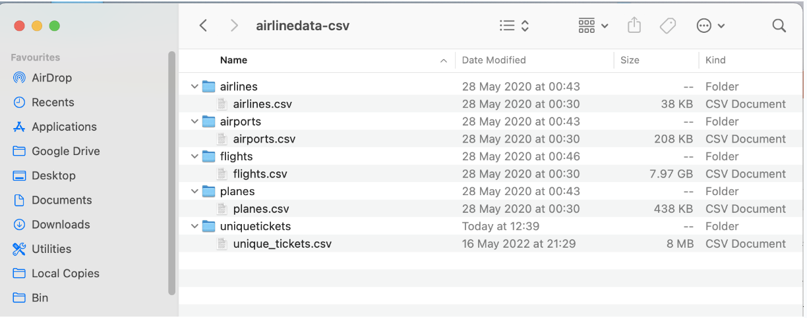

**Handy Iceberg Links**  
[Apache Iceberg Documentation (be careful not everything may be supported yet in CDP)](https://iceberg.apache.org/docs/latest/)  
[Impala Iceberg Cheatsheet](https://docs.google.com/document/d/1cusHyLBA7hS5zLV0vVctymoEbUviJi4aT8SfKyIe_Ao/edit?usp=drive_link)  


# Data Set
Schema for the data set is below: Entity-Relation Diagram of tables we use in todays workshop:

Fact table: flights (86mio rows)
Dimension tables: airlines (1.5k rows), airports (3.3k rows), planes (5k rows) and unique tickets (100k rows).

**Dataset airlines schema**  


**Raw format of the flight set**  

Here displayed in a file explorer:




# PySpark

For reference only, and because Iceberg will integrate nicely with all the components of the Cloudera Data Platform 
and with different engines, the task can be performed in PySpark, looking like so:  

**In pyspark**  
  
```SQL
SELECT partition,file_path, file_size_in_bytes
FROM ${user_id}_airlines_maint.flights.files order by partition

```
# ACID

ACID is an acronym that refers to the set of 4 key properties that define a transaction: 
Atomicity, Consistency, Isolation, and Durability. If a database operation has these ACID properties, 
it can be called an ACID transaction, and data storage systems that apply these operations are called transactional systems.
This set of properties of database transactions intended to guarantee data validity despite errors, power failures, and other mishaps.

In the context of Iceberg specifically, additional information can be found in this [blog article](https://blog.min.io/iceberg-acid-transactions/)


# CDP environments

In CDP, an environment is a logical subset of your cloud provider account including a specific virtual private network. 
You can register as many environments as you require, each living either on prem, in the cloud, in as many supporter cloud providers as you need (out of AWS, Azure, GCP


The “environment” concept of CDP is closely related to the virtual private network in your cloud provider account. 
Registering an environment provides CDP with access to your cloud provider account and identifies the resources in your cloud provider account 
that CDP services can access or provision. 
A single environment is contained within a single cloud provider region,
so all resources deployed by CDP are deployed within that region within one specific virtual network. 
Once you’ve registered an environment in CDP, 
you can start provisioning CDP resources such as clusters, which run on the physical infrastructure in an CSP data center.

# Workload Password

To access non-SSO interfaces, each user and machine user must set a workload password (also known as "FreeIPA password"). An administrator can set other users' workload passwords.
Set your own workload password
As a CDP user, you can see on your profile page if you have previously set your workload password and if the password is about to expire. There are two cases when you may want to set your workload password:
When you first start using CDP.
When your password expires. This may or may not happen depending on your company's policies. If your password does expire, you will see a banner notification on the CDP web interface 10 days before the expiry date.
You can also see on your user’s profile page the state of your workload password (if it expires soon or cannot yet be changed).

# Data hubs

ata Hub is a service for launching and managing workload clusters powered by Cloudera Runtime 
(Cloudera’s unified open source distribution including the best of CDH and HDP)

Data Hub includes a set of cloud optimized built-in templates for common workload types,
as well as a set of options allowing for extensive customization based on your enterprise’s needs. 
Furthermore, it offers a set of convenient cluster management options such as cluster scaling, stop, restart, terminate, and more. All clusters are secured via wire encryption and strong authentication out of the box, and users can access cluster UIs and endpoints through a secure gateway powered by Apache Knox. Access to S3 cloud storage from Data Hub clusters is enabled by default (S3Guard is enabled and required in Runtime versions older than 7.2.2).

Data Hub provides complete workload isolation and full elasticity so that every workload, every application,
or every department can have their own cluster with a different version of the software, different configuration, and running on different infrastructure. This enables a more agile development process.

Since Data Hub clusters are easy to launch and their lifecycle can be automated, you can create them on demand and when you don’t need them,
you can return the resources to the cloud.

*In this lab*, the Kafka instance is hosted in a datahub, directly deployed from the catalog of images 
that comes out of the box in your CDP platform, configured and set up to handle Stream messages worklods. The Template name is `Streams Messaging Light Duty: Apache Kafka, Schema Registry, Streams Messaging Manager, Streams Replication Manager, Cruise Control`
The SSB instance is also hosted in a datahub, template name: `Streaming Analytics Light Duty with Apache Flink`

# Hive Metastore URI

The hive metastore for the datalake is indicated in a configuration file which
can be downloaded from Cloudera Manager:
  
Access the Management Console:  

  


Select the Datalake:  

  


Access the url for the Cloudera Manager of the environment:  

  


Access the Hive metastore service in Cloudera Manager: 

  

Download the Configuration files in a zip:  


In the hive-conf.xml file, grab the value for the hive.metastore.uris
  

Hive Metastore URI example:

`thrift://workshop-aw-dl-master0.workshop.vayb-xokg.cloudera.site:9083`


##### Collect the Kafka Broker endpoints

In CDP Public Cloud, Kafka is deployed in a [Datahub](IcebergLab-Documentation.md#data-hubs), which is a step previously setup by the lab admin.

  

The name of the Datahub to access will be provided by the instructor.

The Kafka broker endpoints are available on the overview page of the Datahub,on the bottom menu, under "Endpoints".

Kafka Endpoints in Datahub overview


# SSB environment
 Creating an environment file for a project means that users can create a template with variables that could be used to
store environment-specific configuration.
For example, you might have a development, staging and production environment, each containing different clusters,
databases, service URLs and authentication methods. Projects and environments allow you to write the logic and create the resources once, and use template placeholders for values that need to be replaced with the environment
specific parameters.
To each project, you can create multiple environments, but only one can be active at a time for a project.
Environments can be exported to files, and can be imported again to be used for another project, or on another cluster.
While environments are applied to a given project, they are not part of the project. They are not synchronized to Git
when exporting or importing the project. This separation is what allows the storing of environment-specific values, or
configurations that you do not want to expose to the Git repository.


# Schemas in SSB


When you select Data Format as AVRO, you must provide the correct Schema Definition when creating the table for SSB to be able to successfully process the topic data. For JSON tables, though, SSB can look at the data flowing through the topic and try to infer the schema automatically, which is quite handy at times. Obviously, there must be data in the topic already for this feature to work correctly.

Note: SSB tries its best to infer the schema correctly, but this is not always possible and sometimes data types are inferred incorrectly. You should always review the inferred schemas to check if it’s correctly inferred and make the necessary adjustments.

